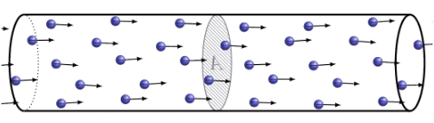

# Descubriendo el Mundo de la Electrónica: Un Viaje a Través de los Circuitos y la Innovación Tecnológica

La electrónica es una disciplina fascinante que ha revolucionado nuestra forma de vivir, trabajar y comunicarnos. En el corazón de la electrónica yace el estudio y control de los electrones, esas diminutas partículas subatómicas que juegan un papel crucial en la creación y funcionamiento de dispositivos electrónicos.

## ¿Qué es la Electrónica?

La electrónica es una rama de la física y la ingeniería que se centra en el estudio y aplicación de sistemas que manipulan señales eléctricas. Su enfoque principal es el control de la corriente eléctrica mediante dispositivos semiconductores, como transistores y diodos. Esto permite la creación de circuitos que realizan diversas funciones, desde procesar información hasta controlar motores y luces.

## Los Elementos Básicos

### Electrones y Corriente Eléctrica

En el corazón de la electrónica está el flujo de electrones. Los electrones, partículas con carga negativa, se desplazan a través de conductores, como cables, creando lo que conocemos como corriente eléctrica. Comprender cómo se mueven y se controlan estos electrones es esencial para cualquier entusiasta de la electrónica.

### Componentes Electrónicos

En el mundo de la electrónica, los componentes son los bloques de construcción. Resistencias, condensadores, inductores, transistores y diodos son algunos de los elementos fundamentales. Combinados en circuitos, estos componentes permiten la creación de dispositivos sofisticados.

## ¿Qué es la Corriente Eléctrica?

La corriente eléctrica es el flujo ordenado de electrones a través de un conductor, como un cable metálico. Los electrones, que son partículas con carga negativa, se desplazan desde una región de baja potencia eléctrica (baja energía) hacia una región de alta potencia eléctrica (alta energía). Este flujo de electrones crea una corriente eléctrica que puede ser aprovechada para realizar trabajo útil.

## Características Clave de la Corriente Eléctrica:

### 1. **Dirección del Flujo de Electrones:**
La corriente eléctrica fluye desde el polo negativo hacia el polo positivo de una fuente de energía, siguiendo la dirección opuesta al flujo real de electrones. Esta convención se estableció antes de que se conociera la verdadera naturaleza del flujo de electrones.

### 2. **Unidad de Medida:**
La unidad estándar de medida de la corriente eléctrica es el amperio (A). Un amperio representa un flujo de carga de un culombio por segundo. Cuanto mayor sea la corriente, más amperios estarán presentes.

### 3. **Tipos de Corriente:**
   - **Corriente Continua (CC):** En CC, los electrones fluyen en una sola dirección constante. Las baterías y pilas generan corriente continua.
   - **Corriente Alterna (CA):** En CA, la dirección del flujo de electrones cambia periódicamente. La corriente eléctrica suministrada por la red eléctrica doméstica es un ejemplo de corriente alterna.

### 4. **Resistencia:**
La resistencia eléctrica, medida en ohmios (Ω), obstaculiza el flujo de corriente en un circuito. Los conductores tienen baja resistencia, mientras que los materiales aislantes tienen alta resistencia.

### 5. **Ley de Ohm:**
La ley de Ohm establece que la corriente (I) en un circuito es directamente proporcional al voltaje (V) e inversamente proporcional a la resistencia (R), expresada por la fórmula I = V/R.

## ¿Cómo se Produce la Corriente Eléctrica?

La corriente eléctrica se origina cuando hay un desequilibrio en la carga eléctrica en un sistema. Esto puede ocurrir mediante la aplicación de una fuerza electromotriz (como una batería) que impulsa a los electrones a través de un conductor.

